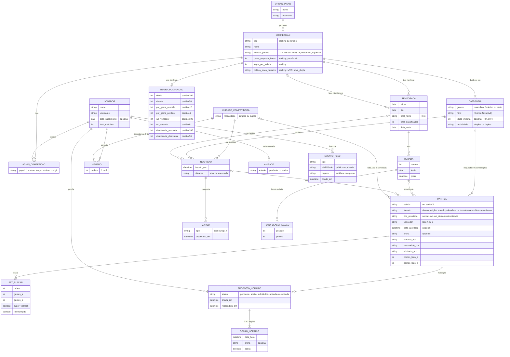
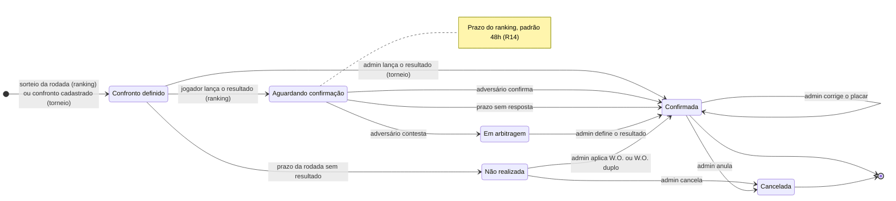
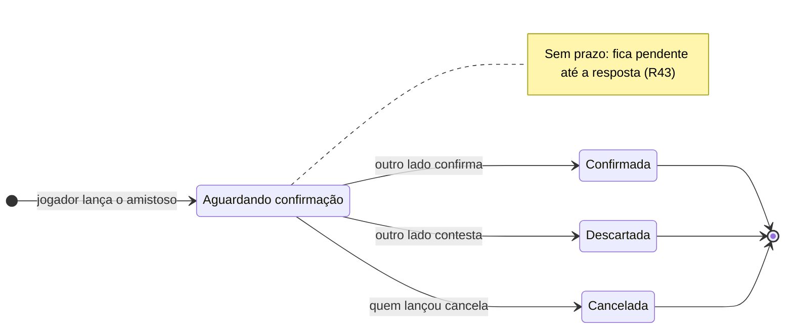

# DOMAIN.md — LetzPlay

Modelo de domínio do LetzPlay: as entidades do Beach Tennis competitivo, como se relacionam e as regras que valem entre elas. É a fonte para os tipos, os mocks e, quando a feature pedir, as tabelas.

> Este doc registra **o que foi decidido**. Cada regra cita a origem (seção "Fontes"). Pergunta nova vira regra só depois da decisão do Gabriel; as já respondidas estão mapeadas na seção 6. Nomes de tabela, colunas e tipos TS são decisão de implementação e não moram aqui.

Para visão e escopo do MVP, ver `docs/PRODUCT.md`. Para a especificação visual dos cards do feed, ver `docs/FEED_CARDS.md`. Para as evidências de mercado, ver `docs/DISCOVERY.md` e `docs/discovery/`.

---

## Fontes

As decisões foram tomadas pelo Gabriel em 26/09/2026 e estão registradas como comentários no Linear. Aqui elas aparecem pela sigla. **Onde duas fontes divergem, vale a mais recente**, e a tabela diz o que cada uma substitui.

| Sigla | Origem | Conteúdo |
| --- | --- | --- |
| **DEC-DOM** | Issue da spec de domínio, comentário "Decisões de domínio do Gabriel" | Unidade competidora, categoria, pontuação por partida, ciclo do resultado, admin, H2H, `total_matches` |
| **DEC-PESQ** | Issue da spec de domínio, comentário "Complemento, com a pesquisa das regras do Rankin e do Vila do Tênis" | Estrutura temporada → rodada → sorteio, tabela de pontos padrão, W.O., desistência, classificação só por dupla. Substitui a DEC-DOM no W.O. |
| **DEC-FINAL** | Issue da spec de domínio, comentário "Final da temporada, decidido" | Final como torneio comum, conquistas permanentes no feed, linha de corte na tela de ranking |
| **DEC-JOGOS** | Issue da spec de domínio, comentário "Mais decisões do Gabriel" | Amistoso, `total_matches` com amistoso, registro de resultado contextual, aba "Jogos", frequência de jogos. Substitui a DEC-DOM no `total_matches` |
| **DEC-MARC** | Issue da spec de domínio, comentário "Marcação de jogo no app" | Propostas estruturadas de horário, histórico como evidência de W.O., o app não aplica W.O. sozinho. Substitui a linha "Data do jogo" da DEC-JOGOS |
| **DEC-SORT** | Issue da spec de domínio, comentário "Confirmado pelo Gabriel" sobre o sorteio | O admin lança o sorteio no app, e o app gera os confrontos na hora |
| **DEC-RESP** | Issue da spec de domínio, comentário "Respostas do Gabriel às perguntas da spec" | Respostas às perguntas P1–P13, formato da partida, sorteio sem repetição, amistoso em simples e duplas. Substitui a DEC-SORT em dois pontos: a falta de resposta não vai mais para o admin (P1), e o torneio não tem chave no app |
| **DEC-FIM** | Issue da spec de domínio, comentário "Respostas do Gabriel às P14–P19" | Confrontos do torneio, formato por competição, amistoso pendente sem prazo, idade sem data de nascimento, fechamento da rodada, confirmação das leituras do agente e cancelamento do amistoso pendente. Substitui a DEC-RESP no formato, que passa a ser da competição |
| **DEC-CARDS** | Issue do diagnóstico dos cards do feed, respostas às perguntas D1–D7 | H2H no card e na página, confronto definido no ranking, nome da categoria, textos neutros |
| **DEC-FEED** | Issue da spec do feed com dados reais, comentário "Princípio do feed" | Feed público mostra conquistas e crescimento; evento com visibilidade |
| **PESQ-RV** | Regras públicas do Rankin e do Vila do Tênis (BH), que usam o LetzPlay legado com a mesma configuração: `letzplay.me/rankin/rankings/55513/about`, `letzplay.me/vila-tenis-bt/rankings/56068/about`, `viladotenis.com/area-do-atleta` | Referências reais de jogos por rodada, prazo para combinar a data, regra de desistência, regra de W.O. por oferta de datas |
| **DSC** | `docs/DISCOVERY.md` e `docs/discovery/` | Evidência de mercado citada nas regras e nas perguntas |

---

## 1. Glossário

As entidades estão agrupadas pelo papel que cumprem. Os nomes em **negrito** são os termos canônicos: use-os nos textos da interface, nas issues e nos PRs.

### Pessoas e relações

| Termo | Definição | Regras |
| --- | --- | --- |
| **Jogador** | Pessoa com conta no LetzPlay. Tem nome, @username, foto, **data de nascimento opcional** e o contador `total_matches`. O cadastro não coleta gênero | R18, R19, R26, R33 |
| **Amizade** | Conexão bilateral entre dois jogadores: um pede, o outro aceita. Só a amizade aceita gera evento no feed | R24 |
| **Admin da competição** | Jogador com permissões **numa competição específica** (ranking ou torneio): lançar o sorteio, lançar o resultado do torneio, arbitrar contestação, decidir a partida não realizada e corrigir ou anular placar. É um papel mínimo, não a visão do organizador | R15, R38–R41 |

### Competição

| Termo | Definição | Regras |
| --- | --- | --- |
| **Organização** | Arena, clube, federação ou grupo que promove competições. Aparece no cabeçalho dos cards de resultado, confronto e inscrição | — |
| **Competição** | Guarda-chuva de tudo que se disputa. Tem dois tipos, com peso igual no produto: **ranking** e **torneio** | R3, R6 |
| **Ranking** | Competição contínua, dividida em temporadas. Os confrontos saem de sorteios por rodada; o jogador não escolhe o adversário. Guarda a **regra de pontuação**, o **formato da partida** (um só), o **prazo de resposta** (padrão 48h), o número de **jogos por rodada** e a **política de troca de parceiro** | R7, R9, R14, R17, R29 |
| **Torneio** | Competição discreta, de 1 ou 2 dias. **No MVP, o app não gera a chave:** o torneio tem inscrição, confronto e resultado lançado pelo admin, e a chave vem de fora do app. Guarda um **formato padrão**, que o admin troca na partida que fugir dele. A final de uma temporada de ranking é um torneio comum | R27, R29, R31, R38 |
| **Temporada** | Período de um ranking (em geral, um semestre). Guarda o **nome da final** (livre: "Saideira", "Finals"), a **quantidade de classificados** e a **data de corte**. Os pontos somam dentro da temporada | R8, R27, R28 |
| **Rodada** | Etapa da temporada, com **prazo**. Cada rodada tem um sorteio, e cada unidade competidora joga nela o número de partidas definido pelo ranking (Rankin: 4; Vila: 2) | R7, R40, R46 |
| **Categoria** | Divisão de uma competição por **gênero + nível + idade** (ex.: "Masculino B", "Mista C 40+"), com a **modalidade** simples ou duplas. Uma competição tem várias categorias; a classificação é por categoria | R3, R4, R33 |
| **Regra de pontuação** | Tabela de valores de um ranking: vitória, derrota, por game vencido, por game perdido, W.O. e desistência. Nasce com o padrão da R9 | R9–R11, R36 |
| **Formato da partida** | Como a partida se decide: **1 set de 8**, **1 set de 6** ou **2 sets de 6 com super tiebreak**. É da competição: o ranking tem um só; o torneio tem um padrão, e a partida pode ter outro. No amistoso, quem lança escolhe. Valida o placar digitado e completa o placar na desistência | R11, R29 |

### Quem compete

| Termo | Definição | Regras |
| --- | --- | --- |
| **Unidade competidora** | Quem ocupa um lado da partida e uma linha da classificação: uma **dupla** (duplas) ou um **jogador** (simples) | R1, R3 |
| **Dupla** | Dois jogadores que competem juntos. A identidade da dupla é o par de jogadores. Um jogador tem várias duplas, uma por ranking ou categoria; e a mesma dupla pode estar em vários rankings, com uma inscrição em cada | R2, R17 |
| **Inscrição** | A participação de uma unidade competidora numa categoria: de uma temporada, no ranking, ou do evento, no torneio. É na inscrição que os pontos se acumulam. Tem situação **ativa** ou **encerrada**. Trocar de parceiro gera uma inscrição nova, e a antiga é encerrada | R8, R17, R32, R45 |

### Jogo

| Termo | Definição | Regras |
| --- | --- | --- |
| **Sorteio** | Ato do admin que gera, no app e na hora, os confrontos de uma rodada do ranking. É aleatório e evita repetir confronto na temporada. O sorteio não é guardado como entidade: ele **cria as partidas** | R7, R30 |
| **Confronto** | Uma partida definida e ainda sem resultado. Guarda a **data acordada** e a arena, quando existem. É o que o card "Confronto definido" mostra, no ranking e no torneio | R7, R34, R35 |
| **Proposta de horário** | Oferta de um lado ao outro, ligada a um confronto: de **2 a 3 opções** de data e hora, cada uma com arena opcional. O outro lado aceita uma, e ela vira a data do confronto. Guarda autor, status e os momentos de criação e de resposta, e serve de evidência numa disputa de W.O. | R34, R40 |
| **Partida** | Encontro entre duas unidades competidoras. Numa competição, é de uma categoria e nasce do sorteio (ranking) ou do cadastro do confronto (torneio). No amistoso, nasce do lançamento do resultado e pode ser cancelada por quem lançou enquanto está pendente. Segue a máquina de estados da seção 3 | R7, R12–R16, R42, R43 |
| **Amistoso** | Partida **sem competição**, em simples ou duplas: um jogador marca com outro e registra no app. Não vale ponto de ranking, mas conta no H2H, no feed dos amigos e no `total_matches` | R42–R44 |
| **Tipo de resultado** | **Normal**, **W.O.**, **W.O. duplo** ou **desistência**. Cada tipo pontua e conta de um jeito. O amistoso só termina em normal ou desistência | R9–R12, R36, R44 |
| **Placar** | Sequência de sets, cada um com os games dos dois lados; no formato de 2 sets, o terceiro é um super tiebreak (STB). Na desistência, guarda os games jogados, incluindo o set interrompido, e o placar completado pelo formato é o que pontua. No W.O. e no W.O. duplo não há placar | R9, R11, R29 |
| **Pontuação** | Pontos que cada lado ganha numa partida confirmada de ranking, calculados pela regra do ranking | R8–R11, R36 |
| **Classificação** | Ordem das unidades competidoras de uma categoria numa temporada, pela soma dos pontos, com desempate fixo. Existe **só por unidade competidora**: não há tabela por jogador | R1, R8, R37, R46 |

### Feed

| Termo | Definição | Regras |
| --- | --- | --- |
| **Evento do feed** | Registro automático de algo que aconteceu (resultado, confronto, inscrição, amizade, movimentação no ranking, marco, classificação para a final). Tem **ator**, **tipo**, **origem** (a entidade que o gerou) e **visibilidade**: público ou privado | R20–R24 |
| **Marco** | Conquista permanente de uma unidade competidora, registrada uma única vez por temporada: **Líder** ou **Top N**. Nunca é revogada por uma rodada seguinte | R25, R47 |
| **H2H** | Histórico de confrontos entre dois lados, derivado das partidas confirmadas, amistosos incluídos. No card, entre as duplas exatas; na página de H2H, jogador × jogador | R19 |

### Relações

**Como ler o diagrama:**

- **Unidade competidora + membro** resolve simples e duplas com a mesma estrutura: a unidade tem 1 membro em simples e 2 em duplas. Como a identidade da dupla é o par, "Lucas e Rafael" é a mesma unidade em qualquer competição e no amistoso. É isso que permite o H2H da dupla exata (R19).
- **Inscrição** é onde os pontos moram. A mesma dupla pode estar inscrita em dois rankings, com duas classificações independentes (R2).
- **Os lados da partida** apontam para a inscrição quando a partida é de uma competição, e direto para a unidade competidora no amistoso, que não tem categoria nem inscrição. Numa partida, só uma das duas ligações existe.
- **Classificação** não aparece como entidade: é a soma de `pontos_lado_*` das partidas confirmadas de cada inscrição, ordenada pela R37. A **foto da classificação** guarda a posição de cada inscrição no fim de cada rodada, para o evento "subiu N" e os marcos (R46, R47).
- **Sorteio e confronto** também não aparecem: o sorteio cria partidas, e o confronto é a partida no estado "Confronto definido". A data acordada mora na partida, venha ela de uma proposta aceita ou de uma data informada (R35).
- **Temporada → competição (final)** é opcional: a temporada pode apontar para o torneio que é a final dela.
- **Arena** é texto, não entidade. Nenhuma regra precisa dela como entidade ainda.

---

## 2. Regras de domínio

Regras numeradas para serem citadas em issues, testes e PRs (ex.: "implementa R10"). Cada uma traz a origem entre colchetes. As regras R1–R28 mantêm o número da primeira versão, que outras issues já citam; as novas começam na R29 e ficam na seção do tema delas.

### Unidade competidora e estrutura

- **R1. A classificação é por unidade competidora.** Em duplas, a posição é da dupla, nunca de cada jogador. O LetzPlay não tem tabela por jogador, mesmo que o organizador tenha uma fora do app (o Rankin tem). [DEC-DOM, DEC-PESQ, DEC-CARDS D2]
- **R2. Um jogador participa de vários rankings ao mesmo tempo**, com uma dupla por ranking ou categoria. [DEC-DOM]
- **R3. Simples e duplas existem no ranking, no torneio e no amistoso.** O modelo trata a unidade competidora como dupla ou jogador, e na competição a modalidade é da categoria. [DEC-DOM, DEC-RESP]
- **R4. A categoria é gênero + nível + idade.** O nome segue esse padrão ("Masculino B", "Mista C 40+"), e a modalidade só aparece quando é simples. A §11.5 do `FEED_CARDS.md`, que trata nível e idade como exclusivos, precisa ser corrigida para seguir esta regra. [DEC-DOM, DEC-CARDS D6]
- **R5. Pontos de federação ficam fora do produto.** Torneios que valem ponto para federação existem, mas o LetzPlay não guarda nem calcula esses pontos. [DEC-DOM]
- **R6. Ranking de arena e torneio têm peso igual** como tipos de competição. [DEC-DOM, que retoma a síntese do discovery]
- **R7. O ranking funciona em temporada → rodadas → sorteio → partidas.** O admin lança o sorteio no app, que gera os confrontos da rodada na hora (R30). O jogador não escolhe o adversário. A data é combinada pelas propostas de horário ou informada depois (R34, R35), e o resultado é lançado no app. Por isso o card "Confronto definido" existe também no ranking: ele nasce do sorteio. O número de partidas por rodada e de rodadas por temporada varia por ranking (Rankin: 4 jogos por rodada; Vila: 2 jogos por rodada, 4 rodadas por semestre, 72h para combinar a data). [DEC-PESQ, DEC-SORT, DEC-MARC, DEC-CARDS D3, PESQ-RV]
- **R29. O formato da partida é da competição.** O ranking tem um formato só. O torneio guarda um formato padrão, e o admin troca o formato da partida que fugir dele (ex.: grupos em set de 6, final em 2 sets). No amistoso, quem lança escolhe um dos três. São eles:
  - **1 set de 8:** no 7/7, vai a 9; no 8/8, tie-break a 7. Placares válidos: 8/0 a 8/6, 9/7 e 9/8.
  - **1 set de 6:** no 5/5, vai a 7; no 6/6, tie-break a 7. Placares válidos: 6/0 a 6/4, 7/5 e 7/6.
  - **2 sets de 6:** cada set segue a regra do set de 6, e no 1 set a 1 a partida se decide no super tiebreak.

  O app usa o formato para **validar o placar digitado** e para **completar o placar na desistência** (R11). [DEC-RESP, DEC-FIM P15, P18]
- **R30. O sorteio é aleatório e não repete confronto na temporada.** O confronto só se repete quando não sobra combinação nova na categoria. [DEC-RESP, DEC-SORT]
- **R31. No MVP, o app não gera a chave do torneio.** O torneio tem inscrição, confronto e resultado lançado pelo admin (R38), e a chave vem de fora do app. O único sorteio feito no app é o da rodada do ranking. No primeiro beta, os confrontos do torneio entram por carga do time; quando entrar o primeiro torneio real, o admin passa a cadastrá-los. [DEC-RESP, DEC-FIM P14]
- **R32. No primeiro beta, as inscrições entram por carga do time** (Rankin e Vila), a partir da lista do organizador. [DEC-RESP]
- **R33. A idade da categoria conta pelo ano de nascimento.** "40+" admite quem faz 40 anos no ano da temporada, como na CBT. O jogador pode informar a data de nascimento no perfil (opcional), e o app a usa para validar a idade na inscrição. Sem a data, o jogador pode entrar numa categoria com idade no primeiro beta, e o organizador garante a elegibilidade, porque as inscrições vêm da lista dele (R32). Rever quando a inscrição tiver fluxo no app. [DEC-RESP, DEC-FIM P17]

### Marcação do confronto

- **R34. Um lado propõe de 2 a 3 opções de data e hora, cada uma com arena opcional, e o outro aceita uma.** O horário aceito vira a data acordada do confronto. O app guarda quem propôs, quais opções, quando propôs e quando o outro lado respondeu. A reserva de quadra e a conversa ficam fora do app: o app oferece "Abrir no WhatsApp". O detalhe da interação está em `docs/SCHEDULING.md`. [DEC-MARC]
- **R35. Informar uma data combinada fora das propostas continua valendo.** É o caminho de quem não usa as propostas. [DEC-MARC]

### Pontuação

- **R8. O ranking soma pontos por partida.** A classificação de uma temporada é a soma dos pontos das partidas confirmadas de cada inscrição. [DEC-DOM]
- **R9. Resultado normal: vitória 100, derrota 50, +2 por game vencido, −2 por game perdido.** É o padrão, e todos os valores ficam guardados por ranking. **O super tiebreak conta como 1 game para o vencedor.** [DEC-PESQ, DEC-RESP P6]

  Exemplo, 6/4 6/3: o vencedor fez 12 games e perdeu 7, e leva 100 + 24 − 14 = **110**. O perdedor fez 7 e perdeu 12, e leva 50 + 14 − 24 = **40**.

  Exemplo com STB, 6/4 3/6 10/7: o STB vira 1/0 na soma. O vencedor fez 6 + 3 + 1 = 10 games e perdeu 4 + 6 + 0 = 10, e leva **100**. O perdedor leva **50**.
- **R10. W.O.: quem compareceu leva 100, o ausente leva 0.** Substitui a versão anterior ("o ausente leva derrota"). O W.O. lançado por um jogador segue o ciclo normal do resultado (R13, R14); se o adversário contesta, o admin decide olhando o histórico de propostas (R40). [DEC-PESQ, DEC-MARC]
- **R11. Desistência ou lesão: o placar é completado pelo formato, e valem 100/50 e os ±2 do placar completo.** O vencedor ganha todos os games seguintes até a partida fechar pela regra do formato (R29), e o desistente fica com os games que já tinha. Se a partida chegaria a 1 set a 1, o STB vai para o vencedor (1 game). Quem lança é o adversário de quem desistiu. [DEC-PESQ, DEC-RESP P6, PESQ-RV]

  **Por quê:** com ±2 só no placar parcial, ou com 100/50 fixos, desistir quando se está perdendo renderia mais pontos do que perder o jogo inteiro.

  Exemplo, 2 sets de 6: o desistente venceu o 1º set por 6/4 e desistiu perdendo o 2º por 2/3. O vencedor completa o 2º set em 6/2, e a partida chega a 1 set a 1, então o STB vai para ele (1/0). O vencedor fez 4 + 6 + 1 = 11 games e perdeu 6 + 2 = 8, e leva 100 + 22 − 16 = **106**. O desistente fez 8 e perdeu 11, e leva 50 + 16 − 22 = **44**.
- **R12. Toda partida com resultado tem um tipo: normal, W.O., W.O. duplo ou desistência.** O tipo define a pontuação (R9–R11, R36), a contagem (R18) e o H2H (R19). [DEC-PESQ, DEC-RESP P3]
- **R36. W.O. duplo vale 0 e 0** e não conta como jogo nem no H2H. Só o admin aplica, numa partida não realizada (R40). [DEC-RESP P3]
- **R37. Desempate, nesta ordem:** pontos → confronto direto (só quando exatamente duas unidades empatam e já se enfrentaram) → vitórias → saldo de games → decisão do admin. A lista é fixa no MVP. [DEC-RESP P4]

### Ciclo do resultado

- **R13. No ranking, qualquer jogador da partida lança o resultado, e qualquer jogador do lado adversário confirma ou contesta.** Em duplas, qualquer um dos 4 lança, e responde qualquer um dos 2 adversários: vale a primeira resposta. [DEC-DOM, DEC-RESP P2]
- **R14. Sem resposta no prazo, o resultado é confirmado sozinho. Só a contestação vai para o admin.** O prazo é configurável por ranking, com padrão de **48h**. Quem cala consente, e o admin continua podendo corrigir depois (R15). Revê a DEC-SORT, em que a falta de resposta também ia para o admin. [DEC-DOM, DEC-RESP P1]
- **R15. O admin é um jogador com permissões numa competição, ranking ou torneio:** lança o sorteio (ranking), lança o resultado (torneio), arbitra contestação, decide a partida não realizada e corrige ou anula placar, inclusive depois da confirmação. Não é a visão do organizador. [DEC-DOM, DEC-SORT, DEC-RESP P2]
- **R16. Só partida confirmada pontua, conta e vira evento de resultado.** A partida é confirmada pelo adversário, pelo prazo (R14), pelo admin ou, no torneio, pelo lançamento do admin. [DEC-DOM, DEC-RESP; gatilho do card em `FEED_CARDS.md` §4]
- **R38. No torneio, o admin lança o resultado, sem confirmação.** O resultado lançado já nasce confirmado. [DEC-RESP P2]
- **R39. O admin pode arbitrar a própria partida**, e fica registrado, visível para os envolvidos, quem arbitrou. [DEC-RESP P11]
- **R40. A partida do sorteio sem resultado no prazo da rodada vai para o admin.** Ele decide entre W.O. para um lado, W.O. duplo ou cancelamento, com o histórico de propostas como evidência (referência real do Vila: sem acordo, tem direito ao W.O. quem ofereceu mais datas). **O app nunca aplica W.O. sozinho.** [DEC-MARC, DEC-RESP P3, PESQ-RV]
- **R41. Correção ou anulação depois da confirmação:** o card de resultado acompanha a partida (mostra o placar corrigido e some se a partida for anulada), e os marcos já concedidos ficam. [DEC-RESP P10]

### Amistoso

- **R42. Amistoso é uma partida sem competição.** Não vale ponto de ranking. Conta no H2H (R19), gera card no feed dos amigos (R24) e entra no `total_matches` (R18). É menos comum que o jogo de ranking. [DEC-JOGOS]
- **R43. No amistoso, um lado lança e o outro confirma. Como não existe admin, a contestação descarta o resultado.** Para valer, um dos lados lança de novo e o outro confirma. **Sem resposta, o amistoso fica pendente** até alguém responder: não confirma sozinho, diferente do ranking (R14). Enquanto está pendente, quem lançou pode cancelá-lo. [DEC-JOGOS, DEC-FIM P16]
- **R44. O amistoso vale em simples e duplas e termina em resultado normal ou desistência.** Não existe W.O. em amistoso. [DEC-RESP]

### Troca de parceiro

- **R17. No MVP, trocar de parceiro cria uma dupla nova, que começa do zero.** Na vida real a regra varia por ranking. Por isso o ranking já nasce com um campo de **política de troca**, mas o único valor que funciona no MVP é "nova dupla". [DEC-DOM]
- **R45. A inscrição da dupla antiga fica congelada na tabela, encerrada e sem direito à final.** As partidas pendentes dela vão para o admin, como a partida não realizada (R40). Se o jogador volta ao parceiro antigo na mesma temporada, retoma a inscrição antiga. [DEC-RESP P7]

### Contagens e H2H

- **R18. `total_matches` conta toda partida confirmada do jogador**, em simples e duplas, torneio, ranking e **amistoso**, **exceto W.O. e W.O. duplo**. A desistência conta, porque houve jogo. [DEC-DOM, DEC-JOGOS, DEC-RESP P3, DEC-CARDS D4]
- **R19. H2H: no card, a dupla exata; na página de H2H, jogador × jogador.** O card responde "esses dois lados já se enfrentaram?"; a página serve para avaliar o adversário (JTBD 3). O amistoso conta. **W.O. e W.O. duplo não contam** como confronto nos dois casos. [DEC-DOM, DEC-JOGOS, DEC-RESP P3, DEC-CARDS D1]

### Classificação e feed

- **R20. O feed público mostra conquistas e crescimento.** [DEC-FEED]
- **R21. Todo evento do feed tem visibilidade: público ou privado.** [DEC-FEED]
- **R22. "Caiu no ranking" é privado:** só o próprio jogador vê, como informação, e não vira publicação para os amigos. Em duplas, os dois jogadores da dupla veem. [DEC-FEED; a extensão para a dupla é derivação da R1]
- **R23. A situação "dentro ou fora da final" aparece só na tela de ranking**, como uma linha de corte na tabela. Não existe badge de "zona", que poderia sumir na rodada seguinte. [DEC-FINAL]
- **R24. Eventos automáticos do feed:** resultado confirmado (ranking, torneio e amistoso), confronto definido, inscrição, amizade aceita, movimentação no ranking (subiu é público, caiu é privado), marco e classificação para a final. Variação zero de posição não gera evento. Pendências (resultado a lançar ou a responder, proposta a aceitar) não são eventos: moram na agenda do jogador (seção 4). [DEC-FEED, DEC-FINAL, DEC-JOGOS; `FEED_CARDS.md` §1 e §8.6]
- **R25. Marcos são eventos permanentes de primeira vez.** Nada no feed pode ser desmentido na rodada seguinte, nem por uma correção de placar (R41). Quais marcos existem e em que escopo estão na R47. [DEC-FINAL, DEC-FEED]
- **R26. Textos do feed são neutros em gênero** ("agora são amigos", "Liderança"), porque o cadastro não coleta gênero. [DEC-CARDS D7]
- **R46. A tabela atualiza ao vivo; o evento "subiu N" compara o fim da rodada com o fim da anterior.** A tela de ranking reflete cada confirmação, e a posição de cada inscrição no fim de cada rodada fica guardada para a comparação. **A rodada fecha no prazo dela:** o que o admin decidir depois (R40) entra na comparação da rodada seguinte, e o feed não espera a fila do admin. [DEC-RESP P8, DEC-FIM P19]
- **R47. Os marcos são Líder e Top N, contados pela primeira vez em cada temporada.** N é a quantidade de classificados da final, ou 10 quando a temporada não tem final. Se os dois acontecem na mesma rodada, sai um evento só, o de Líder. Como a classificação é da dupla (R1), o marco é da dupla, e o card precisa mostrar os dois jogadores. [DEC-RESP P9]

### Final da temporada

- **R27. A temporada guarda nome da final, quantidade de classificados e data de corte.** A final é um torneio comum. [DEC-FINAL]
- **R28. A vaga na final é por posição na data de corte**, nunca por garantia matemática. Depois do corte, cada classificado ganha o evento "Classificado para a [nome da final]". Inscrição encerrada não tem direito à vaga (R45). [DEC-FINAL, DEC-RESP P7; DSC, oportunidade 2.3]

---

## 3. Máquina de estados da partida

Dois ciclos: o da partida de competição (ranking e torneio) e o do amistoso, que não tem admin.

### Partida de competição

### Amistoso

| Estado | Pontua? | Conta em `total_matches` e H2H? | Evento no feed |
| --- | --- | --- | --- |
| Confronto definido | Não | Não | "Confronto definido" (público) |
| Aguardando confirmação | Não | Não | Nenhum. É pendência dos jogadores (seção 4) |
| Em arbitragem | Não | Não | Nenhum. É pendência do admin |
| Não realizada | Não | Não | Nenhum. É pendência do admin |
| Confirmada | Ranking: sim (R9–R11, R36). Torneio e amistoso: não | Sim, exceto W.O. e W.O. duplo (R18, R19) | "Resultado" (público); no ranking, pode gerar movimentação, marco e, depois do corte, classificação |
| Cancelada | Não | Não | Nenhum. Se era confirmada, o card de resultado some (R41). No amistoso, só a pendente pode ser cancelada, por quem lançou (R43) |
| Descartada (amistoso) | Não | Não | Nenhum |

**Correção pelo admin depois da confirmação** recalcula os pontos da partida e, com eles, a classificação. O card de resultado acompanha, e os marcos ficam (R41).

---

## 4. Agenda do jogador

A navegação é de outras specs, mas o modelo precisa sustentar o que elas mostram. O app tem uma **aba "Jogos"**, a agenda do jogador, e o registro de resultado é **contextual**, sem aba própria: item do bloco de pendências no topo do feed, botão na tela do confronto e notificação. [DEC-JOGOS]

| O que a agenda mostra | De onde vem no modelo |
| --- | --- |
| Confrontos sorteados | Partidas do jogador em "Confronto definido" |
| Próximos jogos | Confrontos com data acordada no futuro (R34, R35) |
| Pendências | Partidas em que o jogador precisa agir: lançar o resultado, confirmar ou contestar, responder uma proposta de horário |
| Histórico | Partidas confirmadas, amistosos incluídos |
| Registrar amistoso | Cria uma partida sem competição (R42) |

**Volume de referência:** de 1 a 2 jogos de ranking por mês em cada categoria (2 é o mais comum) e de 2 a 8 jogos por mês no total. Por isso o bloco de pendências é uma lista: um jogador em 2 categorias tem até 4 jogos de ranking por mês. [DEC-JOGOS]

---

## 5. Fora do MVP

| Item | Por quê | Origem |
| --- | --- | --- |
| **Pontos de federação** (CBT, CBBT, estaduais, dupla chancela) | O app não guarda nem calcula. Torneios que pontuam para federação continuam existindo como torneios comuns | DEC-DOM |
| **Chave do torneio e fases da final** (ex.: classificatória top 16 → final top 8 da Saideira) | A chave vem de fora do app (R31). A final é um torneio comum | DEC-FINAL, DEC-RESP, `PRODUCT.md` |
| **Configurar a política de troca de parceiro** | O campo existe, mas só "nova dupla do zero" funciona. Configurar outras políticas vira issue futura | DEC-DOM |
| **Configurar o desempate** | A lista da R37 é fixa no MVP | DEC-RESP |
| **Visão do organizador** além do papel de admin da competição | O admin sorteia, lança resultado de torneio, arbitra e corrige (R15). Criar competição, categoria e temporada pela interface fica fora; as inscrições do primeiro beta entram por carga (R32) | DEC-DOM, DEC-RESP, `PRODUCT.md` |
| **Chat e reserva de quadra** | A conversa continua no WhatsApp, e a reserva, fora do app. A marcação usa propostas estruturadas (R34) | DEC-MARC, `PRODUCT.md` |
| **W.O. automático** | O app nunca aplica W.O. sozinho: quem decide é o admin (R40) | DEC-MARC |
| **Classificação por jogador** | Só por unidade competidora (R1) | DEC-PESQ |
| **Subir de categoria** | Anotado para o futuro. Referência: no Vila, só sobe quem se classificou para o Finals | DEC-PESQ |
| **Seguir organização** | Decisão anterior, registrada em `FEED_CARDS.md` | `FEED_CARDS.md` |

---

## 6. Perguntas respondidas

Não há pergunta aberta. As perguntas levantadas ao modelar foram respondidas pelo Gabriel e viraram regras:

- **Primeira rodada** (DEC-RESP): P1 → R14; P2 → R13, R38; P3 → R36, R40; P4 → R37; P5 → R33; P6 → R9, R11; P7 → R45; P8 → R46; P9 → R47; P10 → R41; P11 → R39; P12 → R34, R35; P13 → R30, R32.
- **Segunda rodada** (DEC-FIM): P14 → R31; P15 → R29; P16 → R43; P17 → R33; P18 → R29; P19 → R46.

As leituras do agente que derivavam das decisões foram confirmadas na DEC-FIM: o W.O. lançado segue o ciclo normal (R10), o placar da desistência guarda os games jogados (R11), a contestação descarta o amistoso (R43), os marcos saem no fim da rodada (R47) e o estado "Cancelada" cobre cancelamento e anulação.

Pergunta nova de domínio entra aqui com opções, trade-offs e recomendação, e sai quando vira regra.

---

## 7. Riscos para acompanhar no beta

- **Confirmação automática.** A R14 resolve o resultado parado por meses, a queixa mais documentada do legado (DSC, oportunidade 2.1), mas deixa passar um lançamento errado quando o adversário não abre o app. Medir o percentual de resultados confirmados pelo adversário, pelo prazo e pelo admin, e quantas correções o admin faz depois da confirmação.
- **Fila do admin.** Agora ela recebe só contestações, partidas não realizadas e pendentes de dupla desfeita. Medir o tamanho da fila por rodada e o tempo até a decisão.
- **Repetição no sorteio.** Em categorias pequenas, a R30 esgota as combinações rápido: com 6 duplas há 15 confrontos possíveis, e o Rankin sorteia 4 jogos por dupla por rodada (12 partidas). A partir da segunda rodada, repetir é inevitável, e a regra já prevê isso.
- **Amistoso pendente sem prazo.** A R43 não confirma sozinha, então amistosos sem resposta podem acumular na agenda. Medir quantos ficam pendentes por mais de 7 dias.
