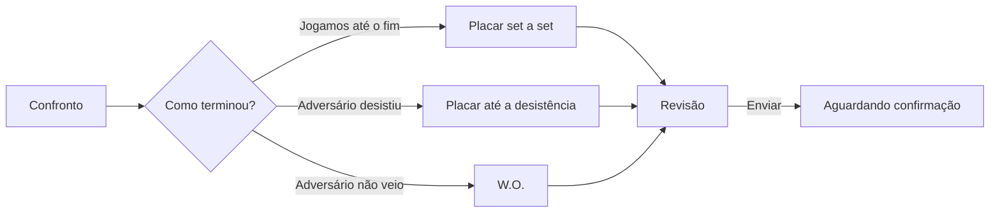

# RESULTS.md — LetzPlay

Spec das telas e dos fluxos do registro de resultado: lançar, confirmar ou contestar, acompanhar, a fila do admin, o amistoso e o que o jogador vê no ranking logo depois da confirmação.

> Este doc detalha a **interação**. As regras do resultado (quem lança e quem confirma, prazos, formatos, pontuação, W.O., desistência, admin, amistoso e a máquina de estados) estão em `docs/DOMAIN.md` e **não são reabertas aqui**. O código delas já existe: `src/lib/domain/matchScore.ts`, `matchPoints.ts` e `match-state/`. As regras deste doc são numeradas **RG1, RG2…**, para não colidir com as R do domínio nem com as M da marcação (`docs/SCHEDULING.md`). Nomes de tabela, colunas, tipos TS e o desenho visual dos componentes são decisão de implementação.

---

## Fontes

As siglas de decisão são as do `docs/DOMAIN.md` > "Fontes". As que esta spec usa:

| Sigla | Conteúdo usado aqui |
| --- | --- |
| **DOMAIN** | Regras R9–R16, R29, R36, R38–R44 e a máquina de estados (§3). Agenda do jogador e registro contextual (§4) |
| **SCHED** | `docs/SCHEDULING.md`: estados da marcação no confronto, "Data passou sem resultado", tela do admin na partida não realizada (M17) |
| **CARDS** | `docs/FEED_CARDS.md`: sistema de placar (§3), card de resultado e variações de W.O. e desistência (§4; na desistência, o placar real com o set interrompido rotulado, §4.4), bloco de posição (§8) |
| **REF-PLACAR** | `docs/discovery/referencias/05-registro-placar.md`: Playtomic (fluxo e validação de set, documentados), cartões de aprovação com prazo (Instacart, Fiverr, Retro, Revolut Business), padrões de entrada numérica, APG Spinbutton |
| **REF-NAV** | `docs/discovery/referencias/07-navegacao.md`: registrar resultado no contexto, badge só para o crítico ("resultado a confirmar é crítico") |
| **INV** | `docs/discovery/referencias/inventario-componentes.md`: ScoreInput, StatusTimeline, SidePicker e primitivos |
| **DSC** | `docs/DISCOVERY.md`: oportunidade 2.1 (registro com confirmação e prazo, a dor com mais evidência), H1 (cold start de dados), H2 (o jogador aceita registrar no app) |
| **NAV** | `docs/NAVIGATION.md`, spec da navegação e agenda, aprovada pelo Gabriel em 29/09: a partida como casa do resultado, a agenda e a seção "Sua vez" (§5), o badge (N3), o fluxo modal de lançar (N18), a área "Administrar" da competição (N30, N31) e o AgendaItem (§11) |
| **DEC-DES** | Decisão do Gabriel de 27/09 sobre a desistência no card: o card mostra o placar real, e o placar completado pelo formato aparece só nas telas de revisão (comentário do orquestrador na issue desta spec, 27/09) |
| **DEC-RES** | Respostas do Gabriel às perguntas P1–P7 desta spec e confirmação das leituras L1–L10 (comentário na issue desta spec, 26/09, ~23:37 UTC) |
| **LEIT** | Leitura do agente desta spec, derivada das fontes acima e confirmada pelo Gabriel na DEC-RES. A lista está na seção 10 |

---

## 1. Princípio

**Lançar um resultado precisa levar menos tempo que mandar o placar no grupo do WhatsApp.** O ranking só anda quando o resultado entra (H1), e o legado tem resultados parados há meses (DSC, oportunidade 2.1). O domínio já cortou o atraso do lado da regra, com a confirmação automática no prazo (R14). O que sobra para a interface:

1. **Placar válido por construção.** O jogador não deveria conseguir montar 7/7 no set de 6. Validar depois de digitar é o plano B, não o A (REF-PLACAR, padrão do Playtomic).
2. **O que acontece sem resposta está escrito na tela.** "Confirma sozinho em 18h" tira a ansiedade dos dois lados (REF-PLACAR, cartões de aprovação).
3. **O resultado confirmado mostra a consequência.** O JTBD 2 pede "ver imediatamente como minha posição foi afetada": a confirmação termina no ranking, não num "ok".

---

## 2. Pontos de entrada

**Esta seção acompanha a spec de navegação** (NAV), por decisão do Gabriel (DEC-RES P7). Se a NAV mudar, esta seção muda junto, e as rotas citadas são as que a NAV propõe. Ao abrir uma partida a partir de outra aba (ex.: o Feed), **a aba de origem continua marcada** (N10). A base é o `DOMAIN.md` §4: registro contextual, sem aba própria (DEC-JOGOS).

- **RG1. A tela do confronto é a casa do resultado.** Uma tela por partida, dentro da aba Jogos, mostra conforme o estado: a marcação (SCHED §6), "Lançar resultado", a resposta com o prazo, a arbitragem e o resultado final. Toda entrada leva a ela, então o registro tem **um lugar só**. Não existe aba nem botão global "Registrar resultado" para ranking e torneio, porque o sorteio (R7) ou o cadastro do torneio (R31) já criaram a partida. [DOMAIN §4, REF-NAV caminho A, NAV, DEC-RES P7]
- **RG2. O badge da aba Jogos conta todo item de "Sua vez"**, como a N3 define: marcar jogo, responder proposta, lançar e confirmar resultado, confirmar amistoso. As pendências de admin contam no badge da aba Competições (N3, N30). Esta spec não cria badge próprio. [NAV N3]

| Entrada | Quem vê | Abre |
| --- | --- | --- |
| **Tela do confronto** (aba Jogos) | Os jogadores da partida | Ela mesma. "Lançar resultado" é a ação principal a partir da data acordada (SCHED, "Data passou sem resultado"); antes dela, secundária |
| **Item "Lançar resultado"** na seção "Sua vez" da aba Jogos e no bloco "Sua vez" do feed (N20) | Os jogadores da partida | **Direto o fluxo de lançar** (§3), sobre a tela do confronto (N16, N18) |
| **Notificação "Como foi o jogo?"** | Os jogadores da partida (§7) | Direto o fluxo de lançar |
| **Item "Confirmar resultado"** em "Sua vez" e notificação de resultado lançado | O lado adversário de quem lançou | A tela do confronto, já rolada até o resultado (§4.1). Confirmar não tem tela própria. "Responder" é só da proposta de horário (NAV 5.2) |
| **Card "Confronto definido" do feed** | Todos | Para os jogadores da partida, a tela do confronto; para os outros, o detalhe público da partida, sem ações. O card não tem botão de lançar |
| **"Registrar amistoso"** no topo da aba Jogos | Qualquer jogador | O fluxo do amistoso (§6) |
| **Bloco "Pendências de admin"** no topo da aba Competições (N30) | Só os admins da competição | A decisão na área "Administrar" da competição (§5, N31). A agenda do admin continua só de jogador |

**O perfil do adversário não é ponto de entrada**: ele serve ao JTBD 3, e um botão de lançar ali duplicaria o lugar da ação.

A tela do confronto mantém a tab bar. **O fluxo de lançar é modal em tela cheia**: cobre a tab bar, tem "Fechar", e fechar ou concluir devolve ao confronto, que já mostra o novo estado. O registro de amistoso segue o mesmo padrão. "Confirmar" não pula direto para nenhum fluxo: abre a partida, porque o jogador precisa ver o placar antes de responder. [NAV]

---

## 3. Lançar o resultado

Vale para o jogador no ranking (R13) e, com as diferenças da §5, para o admin no torneio (R38). O amistoso está na §6.

### Fluxo



Uma tela só (o modal em tela cheia da §2), com rolagem, e não um passo a passo em várias telas: o caso comum (jogo normal, 1 set) cabe inteiro em 393px. A revisão é uma folha (bottom sheet) sobre ela.

### 3.1 Cabeçalho da partida

- **RG3. Os lados vêm prontos e não se editam.** No ranking, quem joga contra quem saiu do sorteio (R7). O cabeçalho mostra os dois lados (o do jogador em cima, "Você e Pedro"), a rodada, a categoria e o **formato**, só como informação ("1 set de 6"). O formato do ranking é um só (R29). [R7, R29; LEIT]

  **Por quê:** o Playtomic tem um passo de "confirmar a posição dos jogadores" porque lá o jogador monta a partida (REF-PLACAR). Aqui o sorteio já montou, e um seletor de lados só criaria a chance de trocar dois jogadores de time.

### 3.2 Como terminou

Um controle de escolha única (SegmentedControl ou grupo de rádio) com três opções, nesta ordem:

| Opção | Tipo de resultado | Depois |
| --- | --- | --- |
| **Jogamos até o fim** (padrão) | Normal | Placar completo (§3.3) |
| **Adversário desistiu** | Desistência | Placar até a desistência (§3.4) |
| **Adversário não veio** | W.O. | Sem placar (§3.5) |

- **RG4. A desistência e o W.O. são sempre a favor de quem lança.** Na desistência, a regra já diz que quem lança é o adversário de quem desistiu (R11). No W.O., o código aceita qualquer vencedor, mas lançar "eu não fui" não acontece na prática; se acontecer, o outro lado lança. As opções são escritas do ponto de vista de quem lança, e o vencedor não é perguntado. A máquina de estados recusa o W.O. lançado a favor do outro lado (R50). [R11, R50; LEIT, confirmada na DEC-RES]
- **RG5. O vencedor do jogo normal sai do placar**, nunca de um campo à parte. Assim o erro `winner_mismatch` do `validateScore` fica impossível na interface. [R29; LEIT]

### 3.3 Placar do jogo normal

O placar é **obrigatório**: a pontuação depende dos games (R9), e o H2H e o perfil usam o placar.

- **RG12. Cada set completo se informa em dois passos: quem venceu o set e quantos games fez quem perdeu.** O vencedor vem de uma escolha entre os dois lados; os games do perdedor, de um grupo de chips com os valores que o formato admite (0 a 6 no set de 6; 0 a 8 no set de 8). O app monta o placar: escolher 5 no set de 6 dá 7/5; escolher 6 dá 7/6 (R29). Só existem placares válidos. [DEC-RES P1]
- **RG13. A prévia do placar aparece ao vivo enquanto o jogador escolhe**, escrita do ponto de vista dele ("6/4 para vocês", "4/6 para Lucas e Rafael"). É o que evita marcar o vencedor errado, o único erro que a RG12 ainda permite. [DEC-RES P1]

```
Set 1 · até 6
  Quem venceu o set?   [ Você e Pedro ]  [ Lucas e Rafael ]
  Games de Lucas e Rafael:  (0) (1) (2) (3) (4) (5) (6)
  → 6/4 para vocês
```

- Cada set completo sai de **2 toques**.
- **Os sets aparecem conforme a partida pede.** No formato de 2 sets, o 2º set aparece depois do 1º; o super tiebreak aparece só no 1 set a 1, com dois campos numéricos (pontos, a partir de 10, com 2 de vantagem). Quem fechou 2 sets a 0 nunca vê o STB. Isso torna impossíveis os erros `too_many_sets`, `set_type` e `undecided` no fluxo normal.
- **A prévia da partida inteira** usa o `ScoreBlock` do feed (CARDS §3): além da frase da RG13, o jogador vê o placar "como vai ficar" no card. **Na desistência, a prévia mostra o placar real**, como o card vai publicá-lo: os sets completos e o set interrompido com o rótulo "Interrompido" (CARDS §4.4). O placar completado pelo formato não entra na prévia: ele vale para os pontos (R11) e aparece só nas telas de revisão (RG6, RG7). [DEC-DES]

### 3.4 Placar da desistência

O jogador informa os sets completos (como em §3.3) e **o set interrompido**, com o placar parcial dos dois lados no momento da desistência. O set interrompido não cabe no "quem venceu + games do perdedor", porque ainda não tem vencedor: cada lado ganha um Stepper (APG Spinbutton), de 0 ao alvo do set.

- **RG6. A revisão mostra o placar completado antes do envio**, abaixo do placar real: "Para os pontos, o placar vale como 6/4 6/2 1/0 (STB), completado pelo formato." É o placar que pontua (R11), e o jogador precisa saber o que vai ser confirmado. A prévia e o card mostram só o placar real (§3.3, DEC-DES). A regra do completamento é do domínio (`completeRetiredScore`); a tela só a mostra. [R11; LEIT]
- **Desistência antes do primeiro game** é o set interrompido em 0/0, e vale como desistência, não como W.O. (o adversário estava lá). A tela não trata como caso especial. [R11, R12; LEIT]

### 3.5 W.O.

Sem placar (R10). A tela mostra uma linha de contexto: "W.O. vale 100 para quem compareceu e 0 para quem faltou. Se o adversário contestar, o admin decide, olhando o histórico da marcação." [R10, R40, SCHED M17]

### 3.6 Revisão e envio

- **RG7. Todo lançamento passa por uma revisão antes do envio**: lados, tipo, placar (completado, na desistência) e "Lucas ou Rafael têm até qui, 20h, para confirmar. Sem resposta, o resultado vale." O botão primário é **Enviar resultado**; o secundário, **Corrigir**. [R14; WCAG 3.3.4 aplicado por analogia (REF-PLACAR); LEIT]
- **RG14. Os pontos previstos aparecem antes de confirmar**, na revisão de quem lança e na tela de quem responde (§4.1): "Se confirmado: +110 para vocês, +40 para Lucas e Rafael." Só no ranking, que é o único que pontua; o cálculo é o do `matchPoints`, com o placar completado na desistência. [DEC-RES P5]
- Depois do envio, a tela do confronto passa ao estado **Aguardando confirmação** (§4.3), com um Toast "Resultado enviado a Lucas e Rafael".

### 3.7 Validação e mensagens

Com a entrada da RG12, quase nenhum erro de placar chega ao jogador. Os `code` do `validateScore` continuam cobertos, porque o servidor sempre valida de novo e o set interrompido e o STB usam campos numéricos:

| `code` | Quando pode aparecer | Mensagem ao jogador |
| --- | --- | --- |
| `no_sets` | Enviar sem nenhum set | "Informe o placar do set 1." |
| `set_score` | Set com placar que o formato não fecha | "6/5 não fecha o set de 6. Placares válidos: 6/0 a 6/4, 7/5 e 7/6." |
| `set_score` (interrompido) | Placar parcial impossível | "7/4 não é um placar parcial no set de 6. Confira os games de cada lado." |
| `undecided` | Placar que não fecha a partida | "Com 1 set para cada lado, falta o super tiebreak." |
| `too_many_sets` | Set além do formato | "A partida já estava decidida no set 2. Remova o set 3." |
| `set_type` | STB fora do lugar | "O super tiebreak só existe no 3º set do formato de 2 sets." |
| `interrupted_set` | Desistência sem set interrompido | "Na desistência, informe o placar do set em que ela aconteceu." |
| `winner_mismatch` | Não aparece com RG5 | — |

As mensagens seguem o `CLAUDE.md` (valor recebido + formato esperado) e o WCAG 3.3.1 e 3.3.3: dizem **qual set** e **por quê**, ligadas ao campo por `aria-describedby`, como o `FormInput` já faz.

**Erros de transição** (`MatchTransitionError`) vêm do servidor, quando o estado mudou enquanto o jogador preenchia:

| `code` | Situação comum | Mensagem |
| --- | --- | --- |
| `invalid_status` | Outro jogador lançou primeiro (R13) | Se foi o parceiro: "Pedro já lançou este resultado." Se foi o adversário: "Lucas já lançou o resultado. Confira e confirme ou conteste." Leva à tela certa (§4) |
| `too_late` | O prazo da rodada acabou (R40) | "A rodada fechou em dom, 23h59. A partida foi para o admin." |
| `not_allowed` | Jogador fora da partida (link antigo, troca de parceiro, R45) | "Você não está nesta partida." |
| `invalid_result` | Desistência lançada pelo lado errado | Não aparece com RG4 |

- **RG8. Falha de rede no envio não perde o que foi preenchido.** O placar fica na tela com um Alert e "Tentar de novo". [LEIT]

---

## 4. Confirmar, contestar e acompanhar

### 4.1 A tela de quem responde

Quem responde é qualquer jogador do lado adversário de quem lançou (R13). A resposta acontece **na tela do confronto** (RG1), com o placar lançado em destaque; a pendência e a notificação abrem o confronto já rolado até ele:

```
Lucas lançou o resultado · ter, 21h10
  [ScoreBlock: Lucas e Rafael 6 · Você e Pedro 4]
  Rodada 3 · Masculino B · 1 set de 6
  Se confirmado: +40 para vocês, +110 para Lucas e Rafael
  Confirma sozinho em 18h (qui, 21h10)
  [ Confirmar ]            ← primário
  [ Contestar ]            ← secundário
```

- **RG9. O prazo aparece em contagem e em data absoluta**, lado a lado: "Confirma sozinho em 18h (qui, 21h10)". Nas últimas 24h, só a contagem ganha a cor de atenção. [R14; REF-PLACAR (Instacart, Fiverr); LEIT]
- **RG10. Confirmar é a ação primária e não pede motivo; contestar é secundária e pede.** A ação comum não pode custar o mesmo que a exceção, e um botão de mesmo peso num resultado que muda o ranking convida ao toque errado. [REF-PLACAR, "o que evitar"; LEIT]
- **O parceiro de quem lançou** vê a mesma tela sem as ações, com "Aguardando Lucas ou Rafael". Ele não responde (R13).

### 4.2 Contestar

Contestar abre uma folha com o que acontece depois: "O resultado vai para o admin do Ranking Bacuri, que define o placar. Até lá, a partida não pontua."

- **RG15. A contestação pede um motivo, obrigatório, numa lista curta:** placar diferente · outro vencedor · o jogo não aconteceu · outro. Com "placar diferente", o jogador pode informar o placar que lembra, com a mesma entrada da §3.3 (opcional). O admin vê os dois na arbitragem (§5.1). O modelo guarda o motivo e o placar lembrado junto de quem contestou e quando (`ResultContest`, R49). [DEC-RES P2]

Depois de contestar, a partida entra **Em arbitragem** para os 4 jogadores.

### 4.3 Acompanhar

Todos os jogadores da partida veem o estado dela na tela do confronto, como uma linha do tempo curta (StatusTimeline), no padrão do histórico da marcação (SCHED §6):

| Estado (§3 do domínio) | Quem lançou e parceiro | Lado adversário |
| --- | --- | --- |
| **Aguardando confirmação** | Placar, "Aguardando Lucas ou Rafael", prazo (RG9) | A tela de resposta (§4.1) |
| **Em arbitragem** | "Lucas contestou · qua, 9h. O admin vai decidir." | "Você contestou…" ou "Rafael contestou…" |
| **Confirmada** | Placar final e **como foi confirmada**: pelo adversário, pelo prazo ou pelo admin (e qual admin, R39). Se houve correção, "Placar corrigido por Ana · sex, 10h" | Igual |
| **Cancelada** | "Partida cancelada pelo admin" ou "Resultado anulado pelo admin", com quem e quando | Igual |

- **RG11. Todo ato de admin sobre a partida fica visível aos jogadores dela**, com o nome de quem agiu e quando. A R39 exige isso para a arbitragem da própria partida; a leitura estende a todos os atos (arbitragem, W.O., correção, anulação), porque o jogador que perdeu pontos precisa saber quem mexeu. [R39; LEIT]

### 4.4 Desfazer o lançamento

- **RG16. Quem lançou pode desfazer o lançamento enquanto ninguém do outro lado respondeu.** A ação fica num menu da tela do confronto, no estado Aguardando confirmação, e pede confirmação. A partida volta para Confronto definido, e o lançamento desfeito fica no histórico da partida. Depois da primeira resposta, o caminho é a contestação ou o admin. Só quem lançou desfaz, nem o parceiro, e só até o fim do prazo de resposta. A regra do domínio é a R48. [DEC-RES P3]

---

## 5. Admin

A fila do admin reúne o que só ele resolve (R15). Ela mora na **área "Administrar" da página da competição** (N31, rota proposta `/competicoes/[competicao]/administrar`), visível só para o admin daquela competição, e não na aba Jogos: a agenda do admin é só de jogador. O sinal é o badge da aba Competições e o bloco "Pendências de admin" no topo dela (N3, N30), que lista os itens abaixo, cada um com a competição, e abre a decisão na área "Administrar". O conteúdo:

| Item da fila | Origem | Ação |
| --- | --- | --- |
| **Contestação** | Em arbitragem (R14) | Arbitrar (§5.1) |
| **Partida não realizada** | Prazo da rodada sem resultado (R40) ou dupla desfeita (R45) | Decidir (§5.2) |
| **Confronto de torneio sem resultado** | Confronto definido no torneio cujo horário passou sem resultado (R38, N30) | Lançar (§5.3) |

A fila é ordenada pela idade do item, mais antigo primeiro, e cada item mostra a competição, a categoria, a rodada e os lados. **Corrigir e anular** não são itens da fila: partem da tela de uma partida confirmada (§5.4), à qual a área "Administrar" também leva, pela lista de partidas da competição (N31).

### 5.1 Arbitrar a contestação

A tela mostra o placar lançado, quem lançou e quando, quem contestou e quando, o motivo e, se houver, o placar que quem contestou lembra (RG15). O admin escolhe:

- **Manter o resultado lançado:** um toque, com confirmação.
- **Definir outro resultado:** o mesmo formulário da §3, já preenchido com o lançado, e o admin escolhe também o vencedor na desistência e no W.O. (a RG4 vale só para jogadores).

A decisão confirma a partida (R15). Se o admin é jogador da partida, a tela avisa "Você está nesta partida. A arbitragem fica registrada com o seu nome." (R39).

### 5.2 Decidir a partida não realizada

É a tela já descrita no `SCHEDULING.md` §6 > "Admin": o **resumo por lado** e o **histórico completo** da marcação (M17, o resumo é a issue de implementação da marcação para o admin), e depois as três opções, **W.O. para um lado, W.O. duplo ou cancelar**, sem nenhuma pré-selecionada (R40). O app nunca sugere o W.O.

### 5.3 Lançar o resultado do torneio

O mesmo formulário da §3, com três diferenças (R38, R29):

- o **formato** vem do padrão do torneio e **pode ser trocado** para esta partida;
- o admin escolhe o **vencedor** em todos os tipos, sem a RG4;
- não há revisão de prazo: o resultado **nasce confirmado**. A revisão (RG7) diz isso: "O resultado vale na hora e aparece no feed."

### 5.4 Corrigir e anular

Na tela de uma partida confirmada, o admin tem **Corrigir placar** e **Anular resultado** num menu de ações, visível só para o admin da competição e nunca como botão primário. Ele chega à partida por qualquer caminho, inclusive pela lista de partidas da área "Administrar" (N31).

- **Corrigir** abre o formulário da §3 preenchido. A revisão mostra o antes e o depois e, no ranking, a diferença de pontos de cada lado. O W.O. duplo só aparece quando a partida não teve lançamento (regra do código em `correctResult`).
- **Anular** pede confirmação com a consequência escrita: "A partida sai da classificação e o card some do feed. Os marcos já conquistados ficam." (R41).

---

## 6. Amistoso

O amistoso nasce do lançamento (R42) e não tem admin nem prazo (R43).

### 6.1 Registrar

A tela tem, nesta ordem:

1. **Modalidade:** simples ou duplas (R44).
2. **Lados** (SidePicker): o jogador já está no lado dele; escolhe o parceiro, em duplas, e o adversário ou os adversários.
   - **RG17. Pode ser escolhido qualquer jogador com conta, e os amigos aparecem primeiro na busca.** O outro lado confirma de qualquer jeito (R43), então o risco de abuso é baixo. [DEC-RES P6]
3. **Data e arena:** data obrigatória, com hoje como padrão, sem data no futuro; arena opcional, em texto (o modelo guarda `played_at` e `venue`).
4. **Formato:** um dos três, escolhido por quem lança (R29). O padrão é o do último amistoso do jogador, ou "1 set de 6" no primeiro.
5. **Como terminou:** só "Jogamos até o fim" e "Adversário desistiu". **Não há W.O.** (R44).
6. **Placar**, como na §3.3 e na §3.4, e a **revisão** (RG7), que diz: "Fica pendente até Lucas ou Rafael confirmarem. Não vale ponto de ranking."

### 6.2 Confirmar, contestar e cancelar

- **Confirmar:** como no ranking (§4.1), sem contagem de prazo. No lugar dela: "Lançado há 3 dias".
- **Contestar** avisa antes: "O resultado é descartado. Para valer, um dos lados lança de novo." Não há motivo a informar, porque ninguém vai arbitrar (R43).
- **Cancelar:** só quem lançou, enquanto está pendente, num menu de ações da tela do amistoso (R43).
- Depois de lançado, o amistoso pendente vira uma partida na agenda, com a **mesma tela de confronto** (RG1): confirmar, contestar e cancelar ficam lá.
- **Descartado** e **cancelado** somem da agenda dos 4 e ficam só no histórico de quem lançou, com o estado escrito. [R43; LEIT]

---

## 7. Notificações

Entrada para a spec de notificações básicas, que decide canal e política, como na marcação (SCHED §5). "Os 4" vale para duplas.

| Gatilho | Quem recebe | Texto de referência |
| --- | --- | --- |
| Data acordada passou sem resultado | Os 4 | "Como foi o jogo contra Lucas e Rafael? Lance o resultado." |
| Resultado lançado | Os 2 do lado adversário | "Pedro lançou 6/4 contra vocês. Confirme até qui, 21h." |
| Resultado lançado pelo parceiro | O parceiro de quem lançou | "Pedro lançou 6/4 contra Lucas e Rafael." |
| Prazo de resposta chegando (6h antes) | Os 2 do lado adversário, se ninguém respondeu | "O resultado contra Pedro e você confirma sozinho em 6h." |
| Resultado confirmado (qualquer via) | Os 3 que não confirmaram (ou os 4, pelo prazo ou pelo admin) | "Resultado confirmado: +110 pts. Você está em 3º." |
| Lançamento desfeito (RG16) | Os 2 do lado adversário | "Pedro desfez o resultado lançado. O jogo volta a esperar o resultado." |
| Resultado contestado | O lado de quem lançou | "Lucas contestou o resultado. O admin vai decidir." |
| Admin decidiu, corrigiu ou anulou | Os 4 | "Ana (admin) corrigiu o placar para 6/3." |
| Item novo na fila do admin | Os admins da competição | "1 contestação no Ranking Bacuri · Masculino B." |
| Amistoso lançado | O outro lado | "Pedro registrou um amistoso contra você: 6/4." |
| Amistoso contestado | Quem lançou e o parceiro | "Lucas não confirmou o amistoso. O resultado foi descartado." |

**Não notificam:** cancelamento do amistoso pendente (ele some da agenda de quem ia responder) e correção sem mudança de pontos.

---

## 8. Estados e feedback

### 8.1 Impacto no ranking depois da confirmação

É o momento do JTBD 2. A tabela atualiza ao vivo a cada confirmação (R46), então a posição já mudou quando a partida confirma. O evento "subiu N" do feed continua comparando fins de rodada (R46): **esta seção trata só do que o próprio jogador vê**, não de publicação.

- **RG18. Logo depois da confirmação, a tela do confronto mostra os pontos da partida, a posição atual ao vivo e o delta desde antes desta partida**, para quem confirmou. Os outros jogadores recebem o mesmo na notificação (§7) e veem o bloco ao abrir a partida. O delta compara com a posição antes desta partida, não com o início da rodada: mostra a causa direta. [DEC-RES P4]

```
Resultado confirmado
  [ScoreBlock]
  +110 pts nesta partida
  Você e Pedro estão em 3º no Masculino B   ▲ 2
  [ Ver ranking ]
```

- Mesma estrutura para vitória e derrota. Na derrota, sem cor de atenção no bloco inteiro: só o DeltaIndicator (▼) usa cor, e com seta e texto, nunca só cor (WCAG 1.4.1). O princípio "subir motiva, descer frustra" do `PRODUCT.md` pede não punir a derrota com mais peso visual que o necessário. [CARDS §8.3; LEIT]
- **Marco** (Líder, Top N, R47) sai no fim da rodada e é do feed. Esta tela não antecipa marco.
- Torneio e amistoso não pontuam: a tela mostra só o placar e "Resultado confirmado".

### 8.2 Pendências, vazio, carregando e erro

| Estado | O que o jogador vê |
| --- | --- |
| **Pendências** | Itens de "Sua vez" (NAV 5.1), um por partida, com a ação no próprio item: "Lançar resultado" ou "Confirmar". A ordem e a composição com as pendências da marcação são da NAV (5.1, 5.2) |
| **Vazio** | Segue a NAV: seção sem itens some (N14), e "Sua vez" vira a linha "Nada pendente"; o bloco "Sua vez" do feed só aparece com pendência (N20); o vazio da aba inteira é o da NAV §9.2. Esta spec não tem estado vazio próprio |
| **Carregando** | Skeleton no formato do card da pendência e do ScoreBlock. O formulário de lançamento só abre com a partida carregada |
| **Erro de carregamento** | Alert com "Tentar de novo", sem apagar o que já estava na tela |
| **Erro de envio** | RG8 e as mensagens da §3.7 |

---

## 9. Componentes que a spec pede

Lista para as issues de implementação. **Aqui não se desenha nenhum componente**: nome, onde a spec o usa e o que já existe no `master`. Componente usado por mais de uma área mora em `ui/` (`CLAUDE.md` > "Onde mora cada componente").

| Componente | Tier | Onde aparece | Existe? |
| --- | --- | --- | --- |
| **ScoreInput** (set a set, com set interrompido e STB) | 2 | §3.3, §3.4, §5, §6 | Não. É o de maior risco técnico (INV) |
| **Stepper** (APG Spinbutton) | 1 | Set interrompido (§3.4) | Não |
| **SidePicker** | 2 | Lados do amistoso (§6.1) | Sim, `ui/SidePicker` |
| **Chip** em grupo de escolha única (radio) | 1 | Games de quem perdeu o set (RG12), motivo da contestação (RG15) | Sim, `ui/Chip` |
| **SegmentedControl** | 1 | "Como terminou" (§3.2), modalidade (§6.1) | Sim, `ui/SegmentedControl` |
| **StatusTimeline** | 2 | Acompanhar (§4.3), atos do admin (RG11) | Sim, `ui/StatusTimeline` |
| **Dialog** (modal e bottom sheet) | 1 | Revisão (RG7), contestar (RG15), desfazer (RG16), anular (§5.4) | Sim, `ui/Dialog` |
| **Badge** | 1 | "Aguardando confirmação", "Em arbitragem", "Corrigido" | Sim, `ui/Badge` |
| **DeltaIndicator** | 1 | Impacto no ranking (§8.1) | Sim, `ui/DeltaIndicator` |
| **ScoreBlock** e a variante compacta | 3 | Prévia do placar (§3.3), tela de resposta (§4.1) | Sim, `ui/ScoreBlock`, já com o set interrompido da desistência (CARDS §4.4) |
| **EmptyState**, **Skeleton** | 1–2 | §8.2 (vazio da NAV), carregando | Sim, `ui/EmptyState` e `ui/Skeleton` |
| **AgendaItem**, **CountBadge** | 2, 1 | "Sua vez" e badges (RG2, §2) | Não. São da NAV (§11) e das issues dela |
| **Button**, **Alert**, **Toast**, **FormInput** | 1 | Todo o fluxo | Sim |

---

## 10. Leituras e perguntas respondidas

Não há pergunta aberta. As leituras do agente e as perguntas desta spec foram respondidas pelo Gabriel na DEC-RES:

- **Leituras confirmadas:** L1 → RG1 (só o amistoso não parte de uma partida existente); L2 → RG2 (badge; depois alinhada à N3 na aprovação da NAV); L3 → RG3 (lados fixos no ranking); L4 → RG4 (desistência e W.O. a favor de quem lança); L5 → RG5 (vencedor sai do placar); L6 → RG6 (placar completado da desistência antes do envio; desistência antes do primeiro game é 0/0 interrompido); L7 → RG7, RG8 (revisão e falha de rede); L8 → RG9, RG10 (prazo e peso das ações); L9 → RG11 (atos do admin visíveis); L10 → §6.2 (amistoso descartado ou cancelado no histórico de quem lançou).
- **Perguntas respondidas:** P1 → RG12, RG13 (entrada do placar, com prévia ao vivo); P2 → RG15 (motivo da contestação); P3 → RG16 (desfazer o lançamento); P4 → RG18 (impacto no ranking); P5 → RG14 (pontos previstos); P6 → RG17 (quem entra no amistoso); P7 → §2 (acompanha a NAV).

**Mudanças de domínio que as decisões pediram**, já no `DOMAIN.md`: desfazer o lançamento (RG16 → R48), o motivo da contestação (RG15 → R49) e o W.O. a favor de quem lança (RG4 → R50).

Pergunta nova sobre o registro de resultado entra aqui com opções, trade-offs e recomendação, e sai quando vira regra.

---

## 11. Métricas de sucesso

Medidas por rodada no beta. Sem meta fixa: a primeira rodada define a linha de base.

| Métrica | Definição | Por que importa |
| --- | --- | --- |
| **Tempo até o lançamento** | Mediana entre a data acordada (ou o sorteio, sem data) e o lançamento | É a hipótese H2 medida: o jogador registra no app o que joga |
| **Tempo de preenchimento** | Mediana entre abrir o formulário e enviar | Mede o princípio da §1. Um set de 6 deveria sair em menos de 30 segundos (**meta de referência do agente**, a validar no beta) |
| **Via da confirmação** | % confirmados pelo adversário, pelo prazo e pelo admin | O risco da confirmação automática (`DOMAIN.md` §7). Muito "pelo prazo" quer dizer que o adversário não abre o app |
| **Taxa de contestação** | % dos lançamentos contestados, e % das arbitragens que mudam o placar | Contestação alta com placar mantido sugere contestação por engano ou tática |
| **Erros de validação** | Envios recusados por `code` do `validateScore` | Com a entrada da RG12, deveria ser quase zero. Se não for, a entrada tem um furo |
| **Correções do admin** | Correções depois da confirmação, por rodada | Resultado errado que passou pela confirmação |
| **Amistosos pendentes** | Amistosos sem resposta há mais de 7 dias | Risco já registrado no `DOMAIN.md` §7 |

---

## 12. Riscos para acompanhar no beta

- **O adversário não abre o app.** O resultado confirma pelo prazo (R14) e o erro passa. A notificação de prazo chegando (§7) é a mitigação; a métrica "via da confirmação" mostra se basta.
- **Desfazer como tática.** A RG16 permite desfazer até a primeira resposta. Se lançamentos desfeitos e relançados com outro placar ficarem frequentes, pesar um limite (uma vez por partida, ou uma janela curta).
- **O set interrompido é o caso mais difícil de entender.** A desistência é rara, e o jogador vai ver na revisão um placar completado (RG6) diferente do placar real da prévia, sem ter visto a regra antes. Acompanhar contestações de desistência.
- **Contestação como tática.** Contestar congela a pontuação até o admin decidir. Se a taxa de contestação com placar mantido for alta, o motivo obrigatório (RG15) já é um custo pequeno; se não bastar, rever.
- **O impacto no ranking na derrota.** Mostrar a queda logo depois da confirmação pode frustrar (`PRODUCT.md`, "descer frustra"). Ouvir os jogadores no beta.
