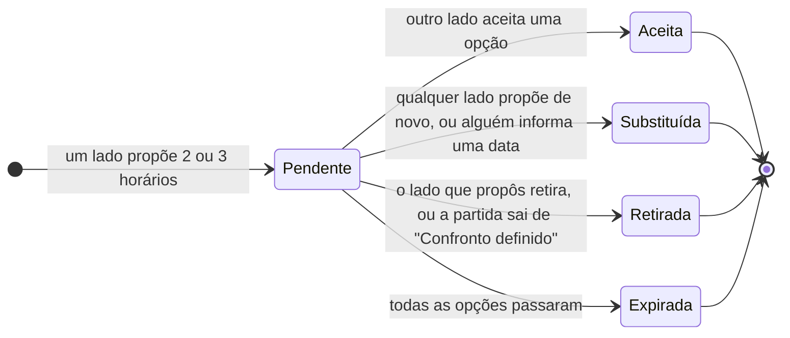

# SCHEDULING.md — LetzPlay

Spec da marcação de jogos: como os dois lados de um confronto do ranking combinam data, hora e arena no app, por propostas de horário, sem competir com o WhatsApp.

> Este doc detalha a **interação** da proposta de horário. A entidade, as relações e as regras de domínio (R34, R35, R40) estão em `docs/DOMAIN.md`, que continua sendo a fonte do modelo. As regras daqui são numeradas **M1, M2…** para não colidir com as R do domínio. Nomes de tabela, colunas e tipos TS são decisão de implementação.

---

## Fontes

As siglas são as mesmas do `docs/DOMAIN.md` > "Fontes". As que esta spec usa:

| Sigla | Conteúdo usado aqui |
| --- | --- |
| **DEC-MARC** | Propostas de 2 a 3 opções com arena opcional, aceite com um toque (revisto pela DEC-ACEITE), histórico como evidência de W.O., "Abrir no WhatsApp", data combinada fora do app. Chat fora do MVP |
| **DEC-RESP** | P2 (qualquer jogador de cada lado lança e responde; vale a primeira resposta) e P3 (o admin decide a partida não realizada depois do prazo da rodada, com o histórico de propostas como evidência) |
| **DEC-JOGOS** | Aba "Jogos", bloco de pendências no feed, volume de 2 a 8 jogos por mês. A linha "Data do jogo" foi substituída pela DEC-MARC; o lembrete no dia do jogo é mantido aqui como leitura (L8) |
| **DEC-ACEITE** | Decisão do Gabriel que revê o aceite da DEC-MARC: o jogador escolhe uma opção e confirma num botão que diz o que vai acontecer (issue do ScheduleOptionPicker, 27/09, ~17:55 UTC) |
| **DEC-MARC-P** | Respostas do Gabriel às perguntas P1–P3 desta spec, confirmação das leituras L1–L9 e aprovação (issue da spec de marcação de jogos, 26/09, ~21:35 UTC) |
| **PESQ-RV** | Vila: 72h para combinar a data depois do sorteio (não adotado, ver M19); sem acordo, tem direito ao W.O. quem ofereceu mais datas |
| **DSC** | Suposição S22 ("o WhatsApp é substituível", com evidência contra), RS5 e RO3 (o WhatsApp continua sendo a camada de comunicação), regulamento Nômades (desafiante propõe 3 opções de horário no privado) |
| **LEIT** | Leitura do agente desta spec, derivada das decisões acima e confirmada pelo Gabriel na DEC-MARC-P. A lista está na seção 8 |

---

## 1. Princípio

**O app registra o acordo; a conversa continua no WhatsApp.** A síntese do discovery tem evidência de média a forte contra a ideia de substituir o WhatsApp (S22, RS5, RO3): quem tentou passou a apontar para ele. Por isso a proposta de horário não tenta ser conversa. Ela faz três coisas que o WhatsApp não faz:

1. **Estrutura a oferta**: 2 ou 3 horários concretos; quem responde escolhe um e confirma.
2. **Dá memória ao confronto**: a data acordada aparece na agenda e dispara lembretes.
3. **Deixa um registro auditável** para o admin, numa partida que não saiu (R40).

Quem prefere combinar tudo no grupo continua podendo: informa a data depois (R35), ou nem informa. **Nenhuma parte do ciclo do resultado depende de a marcação ter passado pelo app.**

---

## 2. Onde vale

- **M1. A proposta de horário existe só na partida do ranking em "Confronto definido".** [DEC-MARC, R7; LEIT]
  - **Torneio:** a programação é do organizador e vem de fora do app (R31). O jogador não marca horário.
  - **Amistoso:** nasce do lançamento do resultado (R42, R43), então não há confronto para marcar.
  - **Partida em qualquer outro estado** (aguardando confirmação, não realizada, confirmada, cancelada): a marcação fica congelada e só de leitura, porque vira evidência.

---

## 3. Regras da proposta

### Quem propõe e quem aceita

- **M2. Qualquer jogador de qualquer um dos lados propõe.** No ranking sorteado não existe desafiante nem desafiado, então os dois lados podem tomar a iniciativa. A proposta é **do lado**, e o app guarda qual jogador a enviou. [DEC-MARC, DEC-RESP P2; LEIT]
- **M3. Qualquer jogador do outro lado aceita, e vale o primeiro aceite.** É a mesma regra do resultado (R13). Em duplas, quem aceita responde pela dupla: combinar com o parceiro antes é conversa, e fica no WhatsApp. [DEC-RESP P2; LEIT]
- **M4. O lado que propôs não aceita a própria proposta.** Nem o parceiro de quem enviou. [LEIT]

### O que uma proposta contém

- **M5. De 2 a 3 opções de data e hora, cada uma com arena opcional (texto livre).** As opções são distintas entre si. [DEC-MARC]
- **M6. Toda opção precisa estar no futuro e antes do prazo da rodada.** Uma data depois do prazo levaria a partida para o admin como não realizada (R40), então o app não a aceita como opção. [R40; LEIT]
- **M7. Mensagem livre não existe.** O campo de texto é só a arena. Chat está fora do MVP. [DEC-MARC, `PRODUCT.md`]

### Uma proposta aberta por vez

- **M8. Cada confronto tem no máximo uma proposta pendente.** Isso evita dois lados com propostas cruzadas e o aceite de uma delas deixando a outra órfã. [LEIT]
- **M9. Não existe "Recusar" sem alternativa. Quem não pode em nenhum horário propõe outros**, e a nova proposta **substitui** a pendente. Essa é a contraproposta. [DEC-MARC, PESQ-RV; LEIT]

  **Por quê:** a referência do Vila dá o W.O. a quem ofereceu mais datas. Um "Recusar" vazio não oferece data nenhuma e não diz nada ao admin; uma contraproposta registra que aquele lado também tentou. O botão "Nenhum serve" leva direto ao formulário de nova proposta.
- **M10. O lado que propôs pode substituir ou retirar a própria proposta enquanto ela está pendente.** Qualquer jogador do lado pode fazer isso. Retirar não apaga: a proposta fica no histórico como retirada. [LEIT]

### Aceite, expiração e remarcação

- **M11. Aceitar uma opção define a data acordada** (e a arena, se a opção tinha). A proposta passa a aceita, e a opção escolhida fica marcada. [DEC-MARC, R34]

  **Como se aceita:** o jogador escolhe uma opção e confirma num botão que diz o que vai acontecer ("Marcar jogo · sáb, 3 out, 14h"). Não existe aceite num toque: o aceite avisa os outros 3 jogadores (seção 5), publica data e arena no card (M18), vira evidência (M16, M17) e não se desfaz sozinho (M13). Como a proposta não tem prazo de resposta (seção 4), o toque a mais não pesa. [DEC-ACEITE]
- **M12. Uma opção cujo horário passou não pode mais ser aceita.** Quando todas passaram, a proposta **expira** sozinha. Isso não é consequência para ninguém: só libera o confronto para uma nova proposta. [LEIT]
- **M13. Remarcar é propor de novo.** Com a data acordada, qualquer lado pode propor novos horários (chuva, lesão, imprevisto). A data acordada **continua valendo** até a nova proposta ser aceita; se ninguém aceitar, nada muda. [LEIT]

### Data informada fora das propostas

- **M14. Qualquer jogador do confronto pode informar uma data combinada fora do app**, com arena opcional, sem aceite do outro lado. Informar uma data nova substitui a anterior. O app guarda quem informou e quando, e avisa os outros jogadores. [DEC-MARC, R35; LEIT]

  **Por quê sem aceite:** a data não pontua, e o resultado tem a própria confirmação (R13, R14). Pedir aceite para uma data já combinada no WhatsApp seria atrito sem ganho. Como fica registrado quem informou, uma data informada por um lado só tem peso menor como evidência, e o admin enxerga isso.
- **M15. Informar uma data encerra a proposta pendente, se houver**, que fica no histórico como substituída. [LEIT]

### Histórico e evidência

- **M16. Nada da marcação é apagado.** Proposta criada, substituída, retirada, expirada ou aceita e data informada ficam no histórico do confronto, cada item com autor e momento. [DEC-MARC]
- **M17. O histórico é evidência, não veredito.** Na partida não realizada (R40), o admin vê o histórico e um resumo por lado: **quantos horários cada lado ofereceu e em quantas datas distintas**, quantas propostas ficaram sem resposta e se houve data acordada ou informada. Ele também pode considerar o que aconteceu fora do app (ex.: prints do WhatsApp), porque uma oferta feita no grupo é tão válida quanto uma feita no app. **O app nunca sugere nem aplica o W.O.** [DEC-MARC, DEC-RESP P3, R40, PESQ-RV; LEIT]
- **M18. As propostas e o histórico são visíveis só para os jogadores do confronto e para o admin da competição.** A marcação não gera evento no feed (R24: pendências moram na agenda). **Já a data e a arena acordadas aparecem para todos no card público "Confronto definido"**, como o `FEED_CARDS.md` §5 já desenha. O risco de exposição está registrado na seção 10. [R24, DEC-MARC-P P3]

### Máquina de estados da proposta

A proposta aceita continua aceita mesmo depois de uma remarcação: o histórico mostra as duas, e a data acordada é a da mais recente (M13). Quando a partida sai de "Confronto definido" com uma proposta pendente (resultado lançado, prazo da rodada), ela é encerrada como retirada pelo sistema, e o histórico registra o motivo.

---

## 4. Prazos

A marcação convive com dois prazos, e só eles.

- **M19. Não existe janela para marcar.** O único prazo do confronto é o da rodada (R40). A janela de 72h depois do sorteio, que o Vila usa, não entra no app. [DEC-MARC-P P1]

| Prazo | O que acontece quando vence | Origem |
| --- | --- | --- |
| **Horário de cada opção** | A opção deixa de poder ser aceita; sem opções válidas, a proposta expira (M12) | LEIT |
| **Prazo da rodada** | A partida sem resultado vai para o admin como não realizada, e a marcação congela como evidência (R40, M1) | R40 |

**A proposta não tem prazo próprio de resposta.** O que dá urgência é o horário das opções: uma proposta para sábado perde o sentido no sábado. Somar um prazo de resposta à proposta criaria mais um relógio para o jogador acompanhar.

---

## 5. Notificações

Quem é avisado de quê. **O canal (push, e-mail, só no app) e a política de envio são da spec de notificações básicas**, que ainda está no Backlog; esta tabela é a entrada dela. "Os 4" vale para duplas; em simples, são os 2.

| Gatilho | Quem recebe | Texto de referência |
| --- | --- | --- |
| Confronto sorteado sem data | Os 4 | "Confronto definido contra Lucas e Rafael. Proponha horários." |
| Proposta recebida (inclui contraproposta) | Os 2 do outro lado | "Pedro propôs 3 horários para o jogo contra vocês." |
| Proposta enviada pelo parceiro | O parceiro de quem enviou | "Pedro propôs 3 horários para Lucas e Rafael." |
| Proposta aceita | Os 3 que não aceitaram | "Jogo marcado: sábado, 14h, Arena Tucum." |
| Proposta expirada sem aceite | Os 2 do lado que propôs | "Nenhum horário foi aceito. Proponha novos." |
| Data informada ou alterada | Os 3 que não informaram | "Rafael informou o jogo: sábado, 14h." |
| Prazo da rodada chegando sem data | Os 4 | "A rodada fecha em 3 dias e o jogo ainda não tem data." |
| Dia do jogo (data acordada ou informada) | Os 4 | "Hoje, 14h: jogo contra Lucas e Rafael." |

**Não notificam:** proposta retirada (ela some da agenda de quem ia responder) e substituição feita pelo próprio lado (o outro lado recebe a nova como "proposta recebida").

**Depois do jogo**, o pedido de resultado é da spec de registro de partidas.

---

## 6. Interface

As superfícies já estão decididas (referências visuais e DEC-JOGOS): a marcação acontece **na tela do confronto**, dentro da aba "Jogos", e as ações pendentes aparecem no **bloco de pendências do feed**. Esta seção diz o que cada superfície precisa mostrar, não como desenhá-la.

### Estados da marcação no confronto

Do ponto de vista de um jogador, o confronto está sempre em um destes estados:

| Estado | O que o jogador vê | Ação principal | Entra nas pendências do feed? |
| --- | --- | --- | --- |
| **Sem data** | Adversários, rodada e prazo da rodada | "Propor horários"; secundárias "Informar data" e "Abrir no WhatsApp" | Sim, como "marcar jogo" |
| **Proposta aguardando você** | As 2 ou 3 opções, quem propôs e quando | Escolher uma opção e confirmar no botão que diz a escolha ("Marcar jogo · sáb, 3 out, 14h"); "Nenhum serve" (M9) | Sim, como "responder proposta" |
| **Proposta aguardando o outro lado** | As opções enviadas, por quem e quando | "Trocar horários" ou "Retirar"; "Abrir no WhatsApp" | Não: a vez é do outro lado |
| **Data acordada** | Data, hora, arena e como foi definida (proposta aceita ou data informada, e por quem) | "Remarcar" e "Abrir no WhatsApp" | Não. No dia do jogo, o aviso chega pela notificação (seção 5), não pelo feed (`NAVIGATION.md`, N21) |
| **Data passou sem resultado** | A data acordada | "Lançar resultado" (spec de registro de partidas) | Sim, como pendência de resultado |
| **Congelada** | O histórico, só leitura | Nenhuma | Não |

O **histórico** fica recolhido abaixo do estado atual, em linha do tempo ("Pedro propôs 3 horários · seg 20h", "Lucas aceitou sáb 14h · ter 9h"). É o mesmo histórico que o admin vê (M17).

### Quando o outro lado não usa o app

Não há estado especial: a proposta fica **aguardando o outro lado**, como qualquer outra. O que muda é o que o app oferece a quem está esperando:

- **"Abrir no WhatsApp"** leva a proposta para a conversa, com o texto das opções pronto (ex.: "Proponho sáb 14h, dom 10h ou qua 19h na Arena Tucum. Responde no LetzPlay ou aqui."). Abre direto na conversa do jogador que informou o telefone; sem telefone, o jogador escolhe a conversa ou o grupo (M24).
- Se o acordo sair no WhatsApp, **qualquer um informa a data** (M14), e o confronto fica marcado para os 4.
- Se o jogo não sair, o histórico mostra ao admin que um lado ofereceu datas e o outro não respondeu no app (M17). O admin considera também o que houve fora dele.

### Admin

Na partida não realizada (R40), a tela de decisão mostra o **resumo por lado** e o **histórico completo** da marcação (M17) antes das opções W.O. para um lado, W.O. duplo ou cancelamento. Nenhuma opção vem pré-selecionada.

---

## 7. Telefone para o WhatsApp

O "Abrir no WhatsApp" abre direto na conversa quando o jogador informou o telefone. O telefone é **dado pessoal**, então as regras abaixo seguem a LGPD (Lei 13.709/2018): consentimento destacado, finalidade única, o mínimo de gente vendo e apagar quando o jogador quiser. [DEC-MARC-P P2]

- **M20. O telefone é opcional e não faz parte do cadastro.** O jogador informa nas configurações (`NAVIGATION.md` N8, `PROFILE.md` PF9) ou no primeiro toque em "Abrir no WhatsApp". O cadastro continua sendo nome, e-mail e senha. [DEC-MARC-P P2, `PRODUCT.md`]
- **M21. Salvar o telefone exige consentimento explícito**, dado numa ação própria, com a caixa desmarcada e o texto da finalidade ao lado (ex.: "Mostrar meu telefone aos adversários e ao meu parceiro enquanto o jogo não acontece, para marcarmos pelo WhatsApp"). Sem o consentimento, o número não é salvo. O app guarda quando o consentimento foi dado. [DEC-MARC-P P2; LGPD art. 7º, I, e art. 8º]
- **M22. A finalidade é uma só: marcar o jogo.** O telefone não é usado para notificação, divulgação, busca de jogadores nem contato fora de um confronto. Uma finalidade nova pede consentimento novo. [DEC-MARC-P P2; LGPD art. 6º, I e III, e art. 9º, §2º]
- **M23. Só veem o telefone os adversários e o parceiro de um confronto ativo**, ou seja, de uma partida do ranking em "Confronto definido" (M1). Quando a partida sai desse estado, o número deixa de aparecer para eles. **Nunca aparece** no perfil público, no feed, na busca, no histórico da marcação nem para o admin. A regra vale no banco (política de acesso), não só na interface. [DEC-MARC-P P2]
- **M24. Sem telefone, o "Abrir no WhatsApp" continua existindo:** o app monta o texto das opções, e o jogador escolhe a conversa ou o grupo. Com o telefone de um ou mais jogadores do outro lado, o botão oferece cada um deles e também a opção sem número (ex.: mandar no grupo do ranking). [DEC-MARC-P P2]
- **M25. O jogador apaga o telefone quando quiser, nas configurações** (`NAVIGATION.md` N8). Apagar remove o número, não só o esconde, e vale como revogação do consentimento. Excluir a conta também apaga o telefone. Como o histórico da marcação nunca guarda o número (M23), nada sobra depois. [DEC-MARC-P P2; LGPD art. 8º, §5º, e art. 18, VI]

---

## 8. Leituras e perguntas respondidas

Não há pergunta aberta. As leituras do agente e as perguntas desta spec foram respondidas pelo Gabriel na DEC-MARC-P:

- **Leituras confirmadas:** L1 → M2–M4 (quem propõe e quem aceita); L2 → M9 (contraproposta, sem "Recusar" vazio); L3 → M8, M10 (uma proposta pendente por vez); L4 → M6 (opções antes do prazo da rodada); L5 → M13 (remarcar é propor de novo); L6 → M14 (data informada sem aceite); L7 → M1 (só a partida do ranking); L8 → seção 5 (lembrete no dia do jogo); L9 → M17 (histórico é evidência, não veredito).
- **Perguntas respondidas:** P1 → M19 (sem janela para marcar); P2 → M20–M25 (telefone opcional); P3 → M18 (data e arena no card público).

Pergunta nova sobre a marcação entra aqui com opções, trade-offs e recomendação, e sai quando vira regra.

---

## 9. Métricas de sucesso

Medidas por rodada, no beta com Rankin e Vila. Sem meta fixa: a primeira rodada define a linha de base.

| Métrica | Definição | Por que importa |
| --- | --- | --- |
| **Confrontos marcados pelo app** | % dos confrontos do ranking com data acordada por **proposta aceita**, sobre o total sorteado. Mostrar ao lado: % com data informada (M14) e % sem data | É a medida direta de adoção. Data informada alta e proposta baixa quer dizer que o jogador marca no WhatsApp e só registra: é uma resposta válida para a S22 |
| **Disputas de W.O. com evidência do app** | % das partidas decididas pelo admin como não realizadas (R40), ou de W.O. contestado (R10), em que o histórico tem **ao menos uma proposta** | Mede se o registro auditável serve ao admin, o valor declarado da DEC-MARC |
| **Tempo até a data** | Mediana entre o sorteio e a data acordada ou informada | Mostra quanto do prazo da rodada a marcação consome, e se a ausência de janela (M19) deixa tudo para o fim |
| **Jogadores com telefone** | % dos jogadores com confronto ativo que informaram o telefone (M20) | Mostra se o atalho direto para a conversa vale o dado pessoal que pede |
| **Propostas sem resposta** | % de propostas que expiram ou são substituídas pelo próprio lado sem nenhuma resposta do outro | Sinal de que o outro lado não usa o app. Se for alto, a marcação vira monólogo |
| **Uso do "Abrir no WhatsApp"** | % dos confrontos em que alguém tocou no botão | Não é falha: mostra quanto a marcação depende da conversa, a evidência a favor ou contra a S22 |

---

## 10. Riscos para acompanhar no beta

- **O outro lado não abre o app.** A proposta vira monólogo, e o registro favorece quem usa o app. A M17 manda o admin pesar também o que aconteceu fora dele, mas vale medir as propostas sem resposta (seção 9) e ouvir o admin depois da primeira rodada.
- **Aceite sem o parceiro.** Em duplas, um jogador aceita pela dupla (M3) e o parceiro não pode. A saída é remarcar (M13), mas se remarcações forem frequentes, pode valer pedir o aceite dos dois.
- **Jogador da carga sem conta ativa.** As inscrições do beta entram por carga (R32). Quem ainda não entrou no app não recebe proposta nem notificação. É o caso extremo do primeiro risco.
- **Datas informadas por um lado só** (M14) têm peso menor como evidência. Se virarem disputa frequente, o aceite do outro lado pode entrar.
- **O card público mostra onde e quando uma pessoa vai estar.** Pela M18, a data e a arena acordadas aparecem para todos no card "Confronto definido". O Gabriel manteve a decisão sabendo do risco, e nada novo foi criado para mitigá-lo. Acompanhar pedidos de jogadores para esconder a data ou a arena e qualquer relato de uso indevido.
- **Sem janela para marcar, a marcação pode ficar para o fim da rodada** (M19). O tempo até a data (seção 9) mostra se isso acontece e se a fila do admin cresce por causa disso.
- **O telefone é dado pessoal.** A proteção depende da política de acesso no banco (M23) e do apagamento real (M25). Se uma das duas falhar, o número vaza para quem não tem confronto com o jogador. As issues de implementação precisam de teste para as duas.
